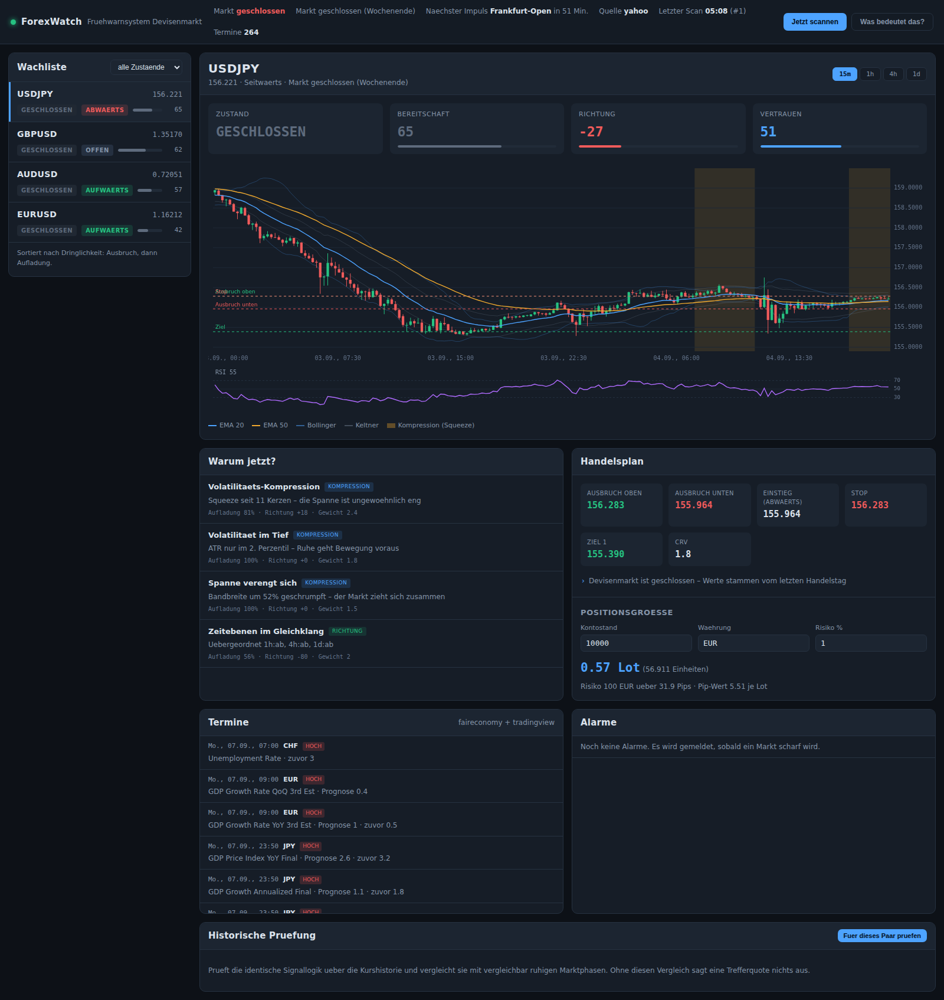

# ForexWatch

Ein Beobachtungs- und Frühwarnsystem für den Devisenmarkt. Es überwacht mehrere
Währungspaare über vier Zeitebenen, erkennt **Marktphasen, in denen sich eine
Bewegung aufbaut**, und meldet sie, bevor der Ausbruch stattfindet.



---

## Zuerst das Wichtigste: was dieses System kann und was nicht

Du hast nach einer App gefragt, die Handelschancen zeigt, *bevor* die Kurse
ausschlagen. Das geht — aber nur zur Hälfte, und diese Hälfte ist sauber
belegbar. Die andere Hälfte ist es nicht. Beide Ergebnisse stehen unten mit
Zahlen aus einem Backtest über **8 Währungspaare, 2 Jahre Stundendaten,
1.612 erkannte Setups und 947 durchgespielte Handel**.

### Was nachweislich funktioniert: der Zeitpunkt

Vor einer größeren Bewegung zieht sich der Markt fast immer zusammen. Diese
Aufladung ist messbar, und das System erkennt sie zuverlässig:

| | nach einem ARMED-Signal | in vergleichbar ruhigen Phasen | Vorsprung |
|---|---|---|---|
| Spanne dehnte sich aus | **49,0 %** | 22,6 % | **+26,4 Prozentpunkte** |
| Ausdehnungsfaktor | **1,70×** | 1,17× | +0,53× |

Der Vergleichswert ist wichtig: verglichen wird **nur gegen Kerzen mit ähnlich
niedriger Vorlauf-Volatilität**. Ein naiver Vergleich gegen alle Kerzen würde
über 1,25× ausweisen und wäre geschönt — ein aufgeladenes Setup setzt enge
Spannen ja bereits voraus, ein Teil der „Ausdehnung" wäre bloße Rückkehr der
Volatilität zum Mittel. Auch nach dieser Bereinigung bleibt der Vorsprung
deutlich und er gilt für **jedes** der acht geprüften Paare (+22 bis +34 pp).

**Das heißt:** Wenn die App ein Paar auf ARMED setzt, passiert dort demnächst
mit rund doppelter Wahrscheinlichkeit etwas. Als Zeitgeber taugt sie.

### Was nicht funktioniert: die Richtung

| | System | Zufallsniveau | Vorsprung |
|---|---|---|---|
| Richtung getroffen | 53,8 % | 51,3 % | +2,5 Prozentpunkte |

Zweieinhalb Prozentpunkte sind bei dieser Stichprobe nicht belastbar. Bei
AUDUSD und NZDUSD lag die Trefferquote sogar **unter** dem Zufallsniveau.

### Und was das fürs Handeln bedeutet

Die eingebaute Handelsregel (Einstieg an der Ausbruchsmarke, ATR-Stop,
Ziel bei 1,8R) wurde mit realistischen Spreads durchgerechnet:

| | ohne Kosten | mit Spread |
|---|---|---|
| Erwartungswert je Handel | +0,034 R | **−0,020 R** |
| Profitfaktor | 1,08 | **0,97** |

Über alle Paare hinweg ist die Regel nach Kosten **leicht negativ**. Nur EURUSD
(+0,135 R) und GBPUSD (+0,048 R) bleiben positiv; USDCHF, AUDUSD, NZDUSD und
EURJPY verlieren.

> **Nutze die App als Aufmerksamkeitssteuerung, nicht als Signalgeber.**
> Sie sagt dir zuverlässig, *wo und wann* du hinschauen solltest. Die
> Richtungsentscheidung musst du selbst treffen — aus Nachrichtenlage,
> übergeordnetem Chartbild und deinem eigenen Handelsansatz. Wer die
> angezeigte Richtung blind handelt, zahlt nach den vorliegenden Zahlen drauf.

Diese Zahlen kannst du jederzeit selbst nachrechnen:

```bash
python run.py --backtest EURUSD
```

---

## Installation

```bash
git clone <repository> && cd Daro-
pip install -r requirements.txt
python run.py
```

Danach im Browser: **http://127.0.0.1:8000**

Es wird kein API-Schlüssel benötigt. Als Datenquelle dient standardmäßig Yahoo
Finance, der Wirtschaftskalender kommt von zwei frei zugänglichen Quellen.

### Kursdaten von Capital.com

Ohne jede Einrichtung läuft die App mit Kursen von Yahoo Finance. Hinterlegst du
deine Capital.com-Zugangsdaten, nutzt sie automatisch die Kurse deines Brokers —
also genau die, zu denen du auch handelst.

Den Schlüssel findest du im Capital.com-Konto unter **Einstellungen → API-Schlüssel**.
Trage in die `.env` ein:

```bash
FW_CAPITAL_API_KEY=dein-schluessel
FW_CAPITAL_IDENTIFIER=deine@email.de
FW_CAPITAL_PASSWORD=dein-api-passwort      # nicht das Login-Passwort
FW_CAPITAL_DEMO=1                          # 1 = Demokonto, 0 = Echtgeld
```

Mehr ist nicht nötig: `FW_PROVIDER=auto` erkennt die Zugangsdaten und schaltet um.
Fehlt eine der Angaben oder lehnt Capital.com die Anmeldung ab, springt die App
ohne Unterbrechung auf Yahoo zurück und schreibt es ins Protokoll.

Was Capital.com gegenüber Yahoo bringt: Geld- und Briefkurs statt nur eines
Mittelkurses (der Spread ist damit direkt ablesbar), ein natives Vier-Stunden-Fenster
und dieselben Kurse, die dein Broker stellt.

### Weitere Einstellungen

Alle Einstellungen sind optional. Kopiere `.env.example` nach `.env`:

```bash
FW_PAIRS=EURUSD,GBPUSD,USDJPY,USDCHF,AUDUSD,USDCAD,NZDUSD,EURJPY,EURGBP,GBPJPY
FW_TIMEFRAMES=15m,1h,4h,1d     # das erste Fenster ist das für Ein- und Ausstiege
FW_SCAN_INTERVAL=60            # Sekunden zwischen zwei Prüfungen
FW_ARM_THRESHOLD=62            # ab hier gilt ein Paar als unter hoher Spannung
FW_TELEGRAM_TOKEN=...          # optionale Meldungen per Telegram
FW_WEBHOOK_URL=...             # optionale Meldungen per Webhook
```

Neben Währungspaaren funktionieren auch `XAUUSD` (Gold), `XAGUSD` (Silber) und
`DXY` (Dollar-Index).

---

## Die Anzeige

Das Programm zeigt zwei Dinge, und die muss man auseinanderhalten.

### Der Tacho: 1 bis 100

| Wert | Bedeutung |
|---|---|
| **82–100** | Kaufen |
| **61–81** | Eher kaufen |
| **41–60** | Abwarten |
| **20–40** | Eher verkaufen |
| **1–19** | Verkaufen |

Der Zeiger verrechnet die Richtung mit der Einigkeit der Einzelsignale. Sind
sich die Signale uneins, bleibt er nahe der Mitte, auch wenn eine Richtung
rechnerisch überwiegt.

### Die Spannung: baut sich etwas auf?

| Anzeige | Bedeutung |
|---|---|
| **Ruhig** | Es passiert wenig. Nichts zu tun. |
| **Es baut sich etwas auf** | Der Markt wird enger. Im Auge behalten. |
| **Hohe Spannung** | Eine Bewegung steht bevor. **Darauf kommt es an.** |
| **Bewegung läuft** | Der Schub hat begonnen — zum Einsteigen meist zu spät. |
| **Bewegung vorbei** | Auf einen Rücksetzer warten. |

**Die Spannung ist der belastbare Teil, der Tacho nicht.** Steht ein Paar auf
*Hohe Spannung*, bewegt es sich danach gut doppelt so oft deutlich wie sonst.
Die Richtung dagegen trifft nur knapp besser als ein Münzwurf. Nutze also die
Spannung als Wecker und entscheide die Richtung selbst.

## Woran das System eine bevorstehende Bewegung erkennt

Sechzehn Detektoren in vier Gruppen. Jeder liefert getrennt einen Beitrag zur
*Aufladung* und zur *Richtung* — diese Trennung ist der Kern des Ansatzes:
Kompression sagt, **dass** etwas passiert, Struktur und Momentum sagen, **wohin**.

**Kompression — es staut sich auf**
- Volatilitäts-Squeeze (Bollinger-Bänder innerhalb des Keltner-Kanals), gewichtet nach Dauer
- ATR im unteren Perzentilbereich der letzten 120 Kerzen
- fortlaufende Verengung der Bandbreite (Keilbildung)
- NR7 und aufeinanderfolgende Inside Bars
- Bündelung von EMA 20/50/200 innerhalb weniger ATR

**Richtung — wohin löst es sich auf**
- Trendausrichtung über alle höheren Zeitebenen
- Marktstruktur aus höheren Hochs und Tiefs
- RSI-Divergenzen gegen den Preis
- Liquiditäts-Abgriffe (Stop-Run mit Ablehnung)
- ADX, der aus dem Niemandsland steigt
- Korrelations-Lücken zwischen verbundenen Paaren

**Struktur**
- Nähe zu Unterstützungs- und Widerstandszonen, verdichtet aus den Swingpunkten
  der höchsten verfügbaren Zeitebene

**Timing — wann ist es so weit**
- ungewöhnlich enge Asien-Spanne vor der London-Eröffnung
- Nähe zu Session-Eröffnungen und dem US-Datenfenster
- anstehende Termine aus dem Wirtschaftskalender

Aus allen Treffern entsteht ein Gesamturteil mit Ausbruchsmarken, Stop, Zielen
und einer zum gewünschten Kontorisiko passenden Positionsgröße.

---

## Bedienung

**Weboberfläche**

```bash
python run.py                      # startet auf 127.0.0.1:8000
python run.py --port 9000
```

Die Oberfläche aktualisiert sich über eine WebSocket-Verbindung selbst. Sie
zeigt die Wachliste nach Dringlichkeit sortiert, einen Chart mit hervorgehobenen
Kompressionsphasen, die Begründung jedes Signals, den Handelsplan mit
Positionsrechner, die anstehenden Termine und die Alarmhistorie.

**Kommandozeile**

```bash
python run.py --scan               # einmaliger Scan als Tabelle
python run.py --backtest EURUSD    # historische Prüfung als JSON
python run.py --backtest GBPUSD --timeframe 4h --bars 6000
```

**JSON-Schnittstelle**

| Endpunkt | Zweck |
|---|---|
| `GET /api/status` | Betriebszustand, Session, Datenquelle |
| `GET /api/setups` | alle Bewertungen, filterbar nach Zustand |
| `GET /api/setup/{paar}` | eine einzelne Bewertung |
| `GET /api/candles/{paar}?tf=1h` | Kerzen samt Indikatorlinien |
| `GET /api/calendar?impact=hoch` | anstehende Termine |
| `GET /api/sessions` | Handelssessions und Volatilitätsfaktor |
| `GET /api/position?...` | Positionsgrößenrechner |
| `GET /api/backtest/{paar}` | historische Prüfung |
| `GET /api/alerts` | Alarmhistorie |
| `POST /api/scan` | Scan außerhalb des Zeitplans |
| `WS /ws` | Live-Aktualisierung |

**Alarme**

Gemeldet wird nur bei einer echten Zustandsänderung — beim Übergang nach
`ARMED`, beim bestätigten Ausbruch und bei einem Richtungswechsel. Innerhalb
desselben Zustands gilt eine Sperrfrist von 15 Minuten, damit dasselbe Setup
nicht im Minutentakt gemeldet wird. Ausgabe erfolgt in die Oberfläche und
optional per Telegram oder Webhook.

---

## Aufbau

```
forexwatch/
├── config.py            Einstellungen aus Umgebung und .env
├── models.py            Kerze, Reihe, Signal, Setup, Alarm
├── storage.py           SQLite: Kerzen-Cache, Verlauf, Alarme
├── providers/           Datenquellen
│   ├── base.py            Schnittstelle und Resampling
│   ├── capital.py         Capital.com, mit Zugangsdaten
│   ├── yahoo.py           Standard, ohne Schlüssel
│   ├── twelvedata.py      optional, mit Schlüssel
│   └── synthetic.py       Offline-Betrieb und Tests
├── analysis/
│   ├── indicators.py      Indikatoren in reinem Python
│   ├── structure.py       Swings, Zonen, Sweeps, Divergenzen
│   ├── sessions.py        Handelszeiten und Asien-Spanne
│   ├── features.py        Vorberechnung je Zeitebene
│   ├── signals.py         die 16 Detektoren
│   └── scoring.py         Verdichtung und Zustandsautomat
├── calendar.py          Wirtschaftskalender aus zwei Quellen
├── risk.py              Niveaus, Pip-Werte, Positionsgrößen
├── alerts.py            Alarmentscheidung und Versand
├── engine.py            Scan-Schleife
├── backtest.py          historische Prüfung
├── app.py               FastAPI und WebSocket
└── web/                 Oberfläche (ohne Fremdbibliotheken)
```

Die Abhängigkeiten beschränken sich auf FastAPI, Uvicorn und httpx. Sämtliche
Indikatoren sind in reinem Python geschrieben — kein NumPy, kein Pandas. Der
Chart ist selbst gezeichnetes Canvas, es wird kein CDN geladen; die App läuft
vollständig offline, sobald Kursdaten im Cache liegen.

**Ausfallsicherheit.** Fällt die Datenquelle aus, greift das System auf den
SQLite-Cache zurück und arbeitet weiter. Fällt der Kalender aus, läuft die
Analyse ohne Termindaten. Ein Fehler in einem einzelnen Detektor bricht den
Scan nicht ab. Ein toter Alarmkanal hält den Scanner nicht an.

---

## Tests

```bash
python -m pytest          # 143 Tests
```

Der wichtigste Test ist `tests/test_backtest.py::TestKeinBlickInDieZukunft`.
Er weist nach, dass die zurückgeschnittene Sicht auf die Indikatoren exakt dem
entspricht, was man zum damaligen Zeitpunkt berechnen konnte — inklusive der
Regel, dass Swingpunkte erst ab ihrer Bestätigung sichtbar werden. Ohne diesen
Nachweis wären sämtliche Zahlen weiter oben wertlos.

---

## Grenzen

- **Yahoo-Daten sind Mittelkurse ohne echtes Volumen.** Die Volumenspalte im
  FX-Bereich ist unbrauchbar und wird deshalb nirgends ausgewertet; die Kurse
  weichen leicht von denen deines Brokers ab. Mit Capital.com-Zugangsdaten
  entfällt beides.
- **Die letzte Kerze ist unvollständig.** Die Analyse arbeitet bewusst mit dem
  laufenden Stand; kurz nach einem Kerzenschluss kann ein Signal daher noch
  wechseln.
- **Der Kalender ist nur so gut wie seine Quellen.** Termine können sich
  verschieben oder fehlen.
- **Der Backtest kennt keine Slippage und keine Spread-Ausweitung um Termine
  herum.** Gerade beim Ausbruchshandel ist die reale Ausführung schlechter als
  angenommen — die ohnehin negativen Handelszahlen oben sind also eher noch zu
  optimistisch.
- **Zwei Jahre Stundendaten sind eine begrenzte Stichprobe.** Sie decken nicht
  jedes Marktregime ab.

---

## Haftungsausschluss

Dieses Programm ist ein Analysewerkzeug und keine Anlageberatung. Devisenhandel
mit Hebel kann zum vollständigen Verlust des eingesetzten Kapitals führen. Die
historischen Kennzahlen sind keine Zusage für die Zukunft. Triff deine
Entscheidungen selbst.
